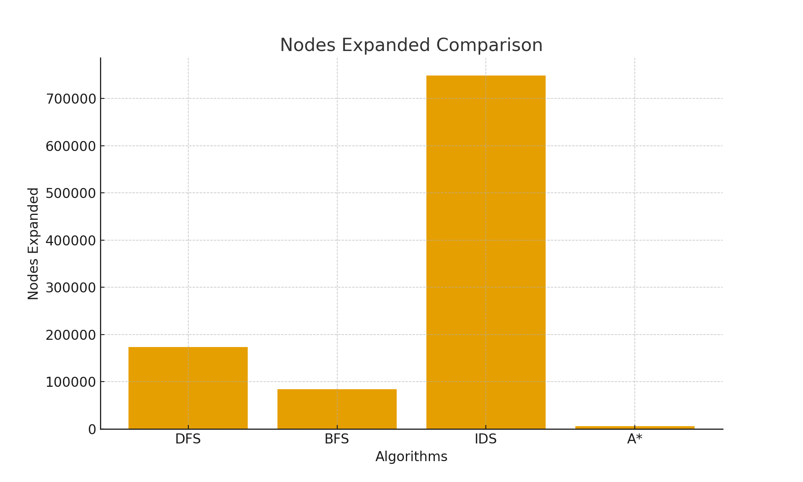
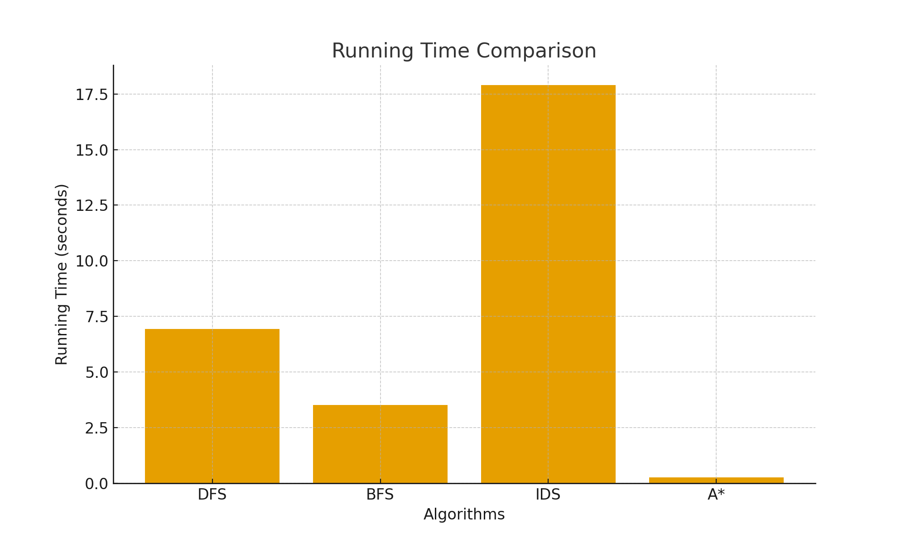
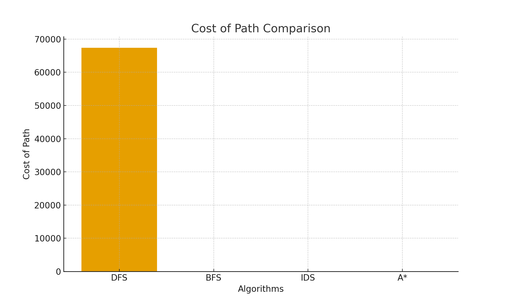

# 🧩 8-Puzzle Solver — BFS, DFS, IDS, and A* Comparison

This project implements four different search algorithms to solve the **8-Puzzle problem**:

- **Breadth-First Search (BFS)**
- **Depth-First Search (DFS)**
- **Iterative Deepening Search (IDS)**
- **A\* Search (with Manhattan Heuristic)**

The objective is to rearrange the 3x3 puzzle board to match the **goal state**:

```
0 1 2
3 4 5
6 7 8
```

Where **0** represents the empty tile.

---

## 🧠 Algorithms Overview

| Algorithm | Strategy | Guarantees Optimal Solution? | Memory Usage | Notes |
|----------|----------|-----------------------------|--------------|------|
| **BFS** | Expands nodes level-by-level | ✅ Yes | ❌ High | Slow when the state space is huge |
| **DFS** | Explores one branch deeply before backtracking | ❌ No | ✅ Low | May go very deep and inefficient |
| **IDS** | DFS with gradually increasing depth limit | ✅ Yes | ✅ Low | Slow due to repeated expansions |
| **A\*** | Uses cost + heuristic to guide search | ✅ Yes | ✅ Efficient | Best performance when heuristic is good |

---

## 🧩 Initial State Used for Testing

```
1 2 3
4 5 6
7 8 0
```

---

## 📊 Experimental Results

| Algorithm | Cost of Path | Search Depth | Nodes Expanded | Running Time |
|----------|--------------|--------------|----------------|--------------|
| **DFS** | 67378 | 67378 | 173,606 | 6.94 sec |
| **BFS** | 22 | 22 | 84,543 | 3.52 sec |
| **IDS** | 33 | 32 | 748,801 | 17.90 sec |
| **A\*** | 22 | 22 | 5,668 | 0.26 sec |

---

## 🔍 Interpretation of Results

### **DFS**
- DFS went extremely deep and generated a **very large path**.
- It **did not find the optimal solution**.
- Time and memory usage increased greatly.
- **Not suitable** for puzzles unless depth is controlled.

### **BFS**
- BFS found the **optimal solution** (22 steps).
- However, it expanded **over 80,000 states**, which is computationally expensive.
- Works well but **scales poorly**.

### **IDS**
- IDS also finds an optimal solution.
- But because it **restarts DFS at every depth**, it expanded **the most nodes**.
- **Very slow** and inefficient here.

### **A\*** (Manhattan Heuristic)
- Found the same shortest path as BFS (22 steps).
- Expanded **far fewer states** (~5,668).
- **Fastest and most efficient** algorithm for this problem.
---
## 🏁 Conclusion
- **DFS** is impractical for the 8-Puzzle due to deep unnecessary exploration.
- **BFS** finds optimal solutions but is slow due to exploring many states.
- **IDS** guarantees optimality but is the most computationally expensive in this case.
- **A\*** with a good heuristic is **by far the best method**:
  - Fastest
  - Explores the fewest states
  - Produces the optimal solution consistently
---

## 📊 Algorithm Performance Comparison
### Nodes Expanded

### Running Time

### Cost of Path

### Search Depth


